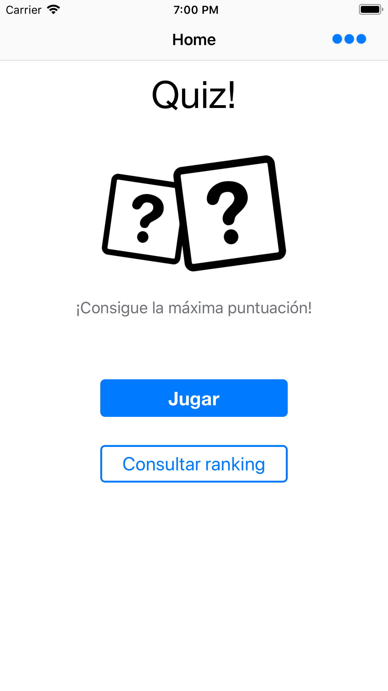
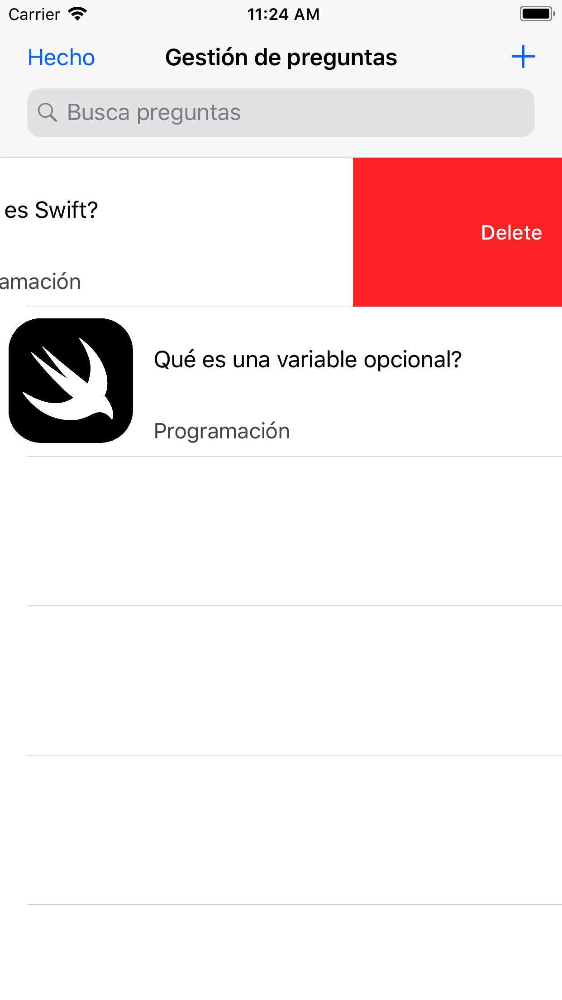
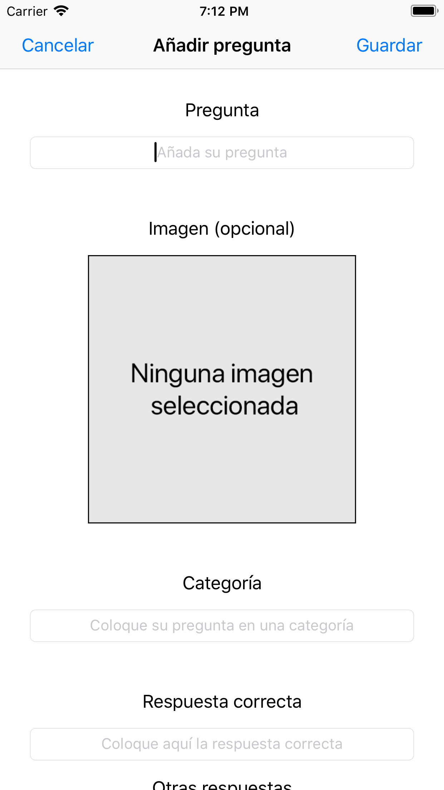
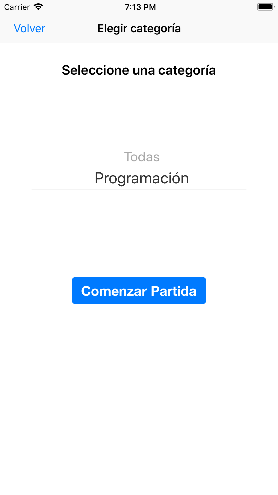
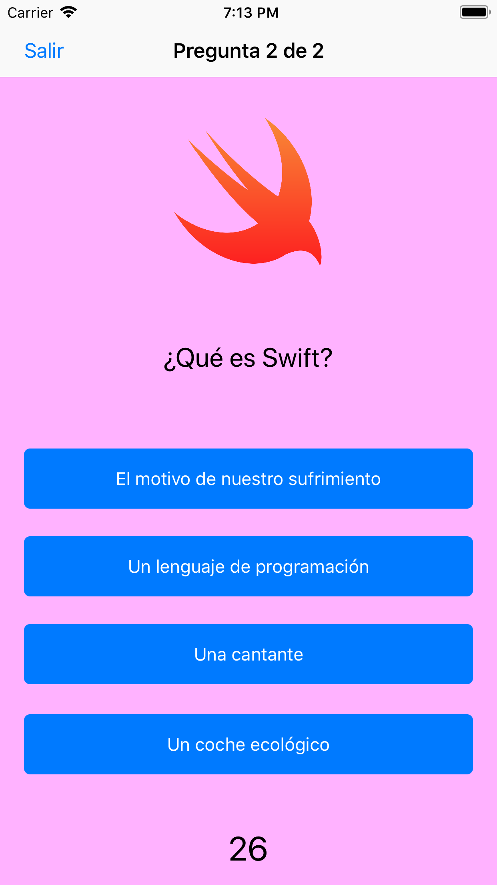
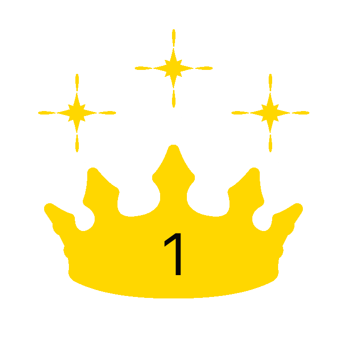
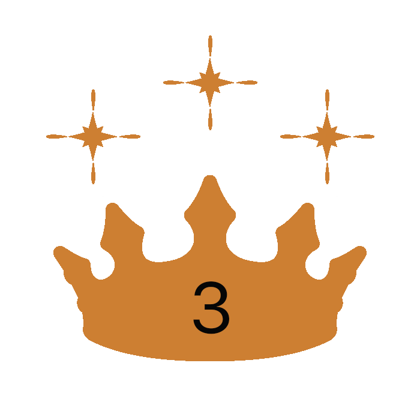
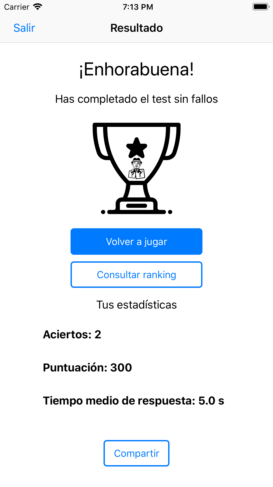
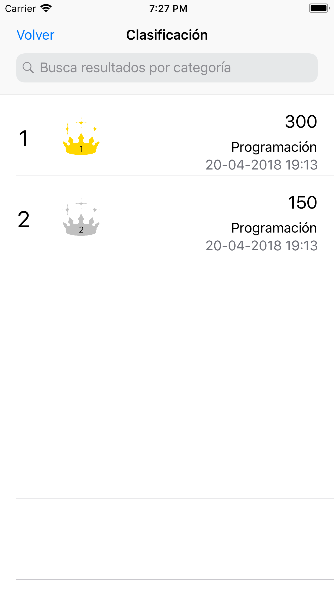
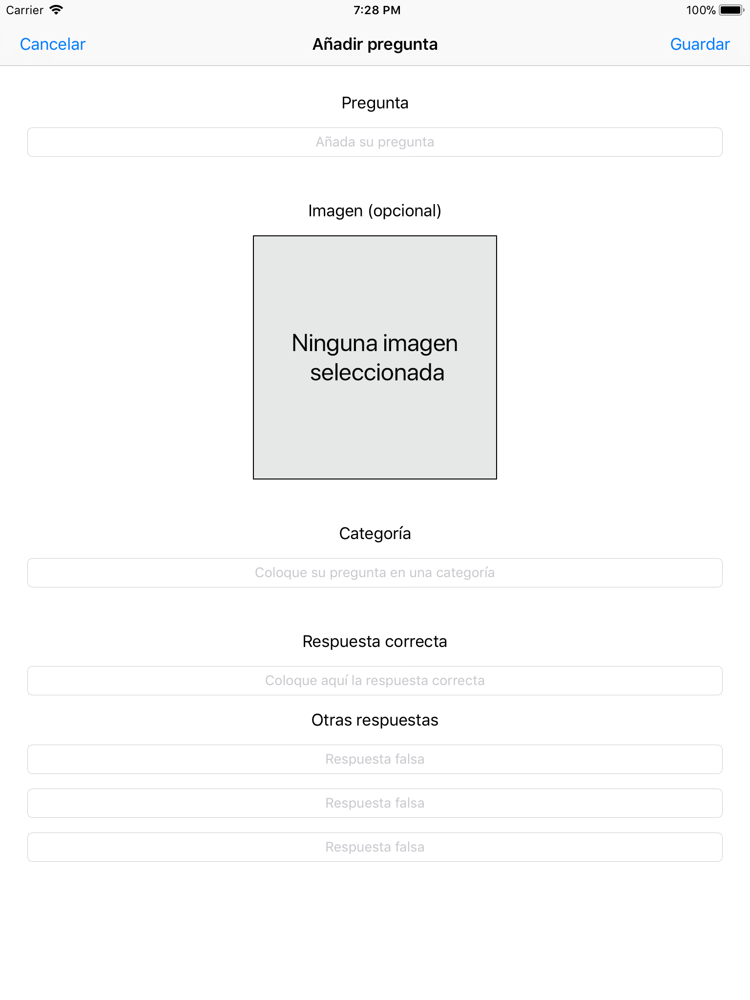

# Quiz!
**Quiz!** es un **juego de preguntas y respuestas** desarrollado en Swift para la asignatura de Desarrollo de Sofware para Dispositivos Móviles en la Universidad de Jaén.

  

### Índice
[Cómo jugar](#cómo-jugar) 
[Cómo probar la aplicación](#cómo-probarlo) 

## Cómo jugar
**Quiz! permite realizar partidas con todas las preguntas de las que se compone tu base de datos**. Por defecto habrá dos preguntas para comenzar a jugar.

  

### Configuración

En el caso de que no haya preguntas no se podrá jugar una partida, y para ello habrá que acceder a la **configuración**, donde podemos gestionar nuestras preguntas.

  

Al acceder a la configuración obtendremos una pantalla como la anterior, la cual tendrá dos modos de funcionamiento:
  * El **primer modo**, en el cual no se pueden gestionar las preguntas, **sólo consultarlas**.
  * Un **segundo modo** donde sí que podemos **añadir, eliminar y modificar preguntas** como aparece en la imagen anterior. Dentro de esta pantalla, las diferentes acciones y sus formas de acceso son:
    - **Añadir preguntas**, mediante el icono en la esquina derecha superior, que nos llevará a una vista como la siguiente:

    

      
    

    
    Todas las preguntas de Quiz! se componen de cuatro respuestas, de las cuales una será la verdadera. Además, podemos asociar las preguntas a categorías, de tal forma que al jugar podemos realizar partidas que sólo contengan preguntas de una determinada categoría.

    - **Eliminar preguntas**, desplazando una fila hacia la izquierda.
    - **Modificar preguntas** presionando en la fila en la que ésta se encuentra, lo que nos llevará a una vista similar a la de añadir preguntas.

### Desarrollo de partida

Una vez tenemos todas las preguntas que deseamos en nuestra base de datos, ¡podemos comenzar a jugar!

  

Como ya comentamos, **desde la pantalla principal se puede acceder a jugar una partida**. Nuestro primer paso antes de comenzar una partida será **elegir la categoría de las preguntas** que queremos que nos aparezcan:

  

Una vez elegida, ¡comienza la partida!
Las preguntas aparecen de forma aleatoria, tanto el orden de preguntas como de las respuestas.

  

**¡Ojo! No podrás fallar ninguna pregunta para alcanzar la victoria**, por lo que si te equivocas en una...

  

Si aciertas, es posible que esto aún no haya terminado o... **¡que hayas ganado!**

  
  
  

Al terminar, sea cual sea el resultado, aparecerá una pantalla como la siguiente:

  

De esta forma puedes elegir volver a jugar, compartir tus resultados o consultar la clasificación.

**La clasificación será un histórico de resultados en tus partidas**, ordenadas de forma descendente según la cantidad de puntos obtenidos.

  

Puedes filtrar los resultados buscando una categoría, e incluso borrar aquellos resultados que desees, tal y como hacíamos con las preguntas (desplazando la fila hacia la izquierda).

### Diseño responsive

La aplicación se adapta a cualquier tipo de dispositivo, ya sea un móvil (iPhone), una tablet (iPad)...

  
  
  

## Cómo probar la aplicación
Para probar la aplicación será tan fácil como clonar el proyecto o descargar la carpeta. Necesitaremos también un ordenador MacOS que contenga al menos Xcode 9.3 (disponible desde el 29 de marzo de 2018).

La carpeta contiene un proyecto de Xcode de tal forma que será tan sencillo como abrir el proyecto con este entorno de desarrollo y ejecutarlo en cualquier dispositivo, ya sea un simulador o conectado al ordenador (iPhone, iPad...).
